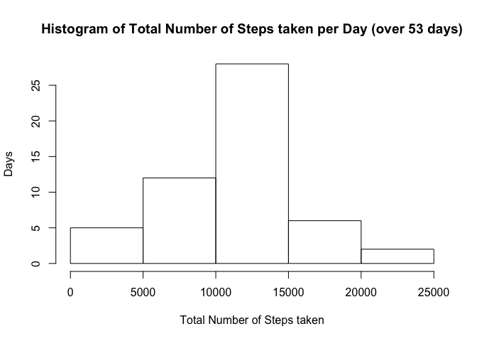
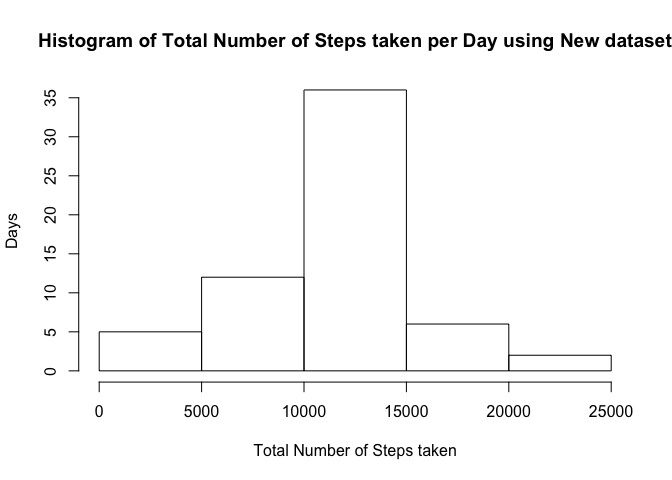

# Reproducible Research: Peer Assessment 1
### Author: Mohamed Hussain Manashia (mhussainm)
   
# Loading required packages
- **dplyr** package used for data transformations.
- **timeDate** package used to factor a date as a weekend or weekday
- **lattice** package used to draw the panel plot

```r
library(dplyr);
```

```
## 
## Attaching package: 'dplyr'
## 
## The following object is masked from 'package:stats':
## 
##     filter
## 
## The following objects are masked from 'package:base':
## 
##     intersect, setdiff, setequal, union
```

```r
library(timeDate);
library(lattice);
```
     
    
## Loading and preprocessing the data

Loading data from the *'activity.csv'* file.

```r
activitydata <- read.csv("activity.csv");
```

Omitting missing values 'NA' from the data.frame loaded.

```r
activitymissingdataomitted <- na.omit(activitydata);
```
  
  
## What is mean total number of steps taken per day?

Grouping the steps count by date using dplyr package, summarizing to
obtain total steps taken per day, and followed by plotting a histogram.

```r
stepsgroupedbydate <- activitymissingdataomitted %>% group_by(date);
totalstepsbydate <- stepsgroupedbydate %>% summarise(totalsteps = sum(steps));
hist(totalstepsbydate$totalsteps, 
     main = "Histogram of Total Number of Steps taken per Day (over 53 days)", 
     xlab = "Total Number of Steps taken",  
     ylab = "Days");
```

 

Coercing **mean and median** as character to prevent from showing up as **1.0766189\times 10^{4}** 
in the generated HTML *(I don't know if this is a knitr package feature or bug!)*.

```r
meantotalstepsperday <- mean(totalstepsbydate$totalsteps);
meantotalstepsperdayaschar <- as.character(meantotalstepsperday);
mediantotalstepsperday <- median(totalstepsbydate$totalsteps);
mediantotalstepsperdayaschar <- as.character(mediantotalstepsperday);
```

##### The **mean** of the total number of steps taken per day is **10766.1886792453**

##### The **median** of the total number of steps taken per day is **10765**.
    
        
## What is the average daily activity pattern?

Grouping the steps count by time interval using dplyr package, summarizing to
obtain average steps per time interval across days, and followed by plotting a
time series plot.

```r
stepsgroupedbyinterval <- activitymissingdataomitted %>% group_by(interval);
averagestepsbyinterval <- stepsgroupedbyinterval %>% summarise(averagesteps = mean(steps));
plot(averagestepsbyinterval$interval, 
     averagestepsbyinterval$averagesteps, 
     type="l", 
     main = "Time Series Plot of Average Number of Steps taken per Time Interval", 
     xlab = "5 Minute Interval",  
     ylab = "Average Number of Step taken");
```

 

Filter to identify the row of data.frame that holds the maximum average steps to 
identify the interval it is associated with.

```r
intervalwithmaxavgsteps <- filter(averagestepsbyinterval, 
                                  averagesteps == max(averagesteps))$interval;
```
##### The **5-minute interval** with maximum number of steps on average across all the days is **835**.
  
  
## Imputing missing values

Using complete.cases() to determine number of rows with missing data.

```r
numofrowswithmissingvalues <- sum(!complete.cases(activitydata));
```
##### The **number of rows** with missing data in the original data are **2304**.

Filling in missing values for Steps and creating a new dataset with missing data filled in. After copying the orginal dataset to a new data.frame use the ave() function to derive the mean of *steps for the same interval* as of the missing  *steps*.
   
**Strategy applied to impute missing data:** Taking average (mean) of the number of steps taken for the same time interval as of the missing (NA) steps across all the days.

```r
activitydatacomplete <- activitydata;
activitydatacomplete$steps[is.na(activitydatacomplete$steps)] <- ave(activitydatacomplete$steps, activitydatacomplete$interval, FUN=function(x)floor(mean(x, na.rm = T)))[is.na(activitydatacomplete$steps)];
```

Summary of original dataset with missing *steps* values as NA.

```r
summary(activitydata);
```

```
##      steps                date          interval     
##  Min.   :  0.00   2012-10-01:  288   Min.   :   0.0  
##  1st Qu.:  0.00   2012-10-02:  288   1st Qu.: 588.8  
##  Median :  0.00   2012-10-03:  288   Median :1177.5  
##  Mean   : 37.38   2012-10-04:  288   Mean   :1177.5  
##  3rd Qu.: 12.00   2012-10-05:  288   3rd Qu.:1766.2  
##  Max.   :806.00   2012-10-06:  288   Max.   :2355.0  
##  NA's   :2304     (Other)   :15840
```

Summary of new dataset with missing *steps* values filled with mean of steps for the same *interval*.

```r
summary(activitydatacomplete);
```

```
##      steps                date          interval     
##  Min.   :  0.00   2012-10-01:  288   Min.   :   0.0  
##  1st Qu.:  0.00   2012-10-02:  288   1st Qu.: 588.8  
##  Median :  0.00   2012-10-03:  288   Median :1177.5  
##  Mean   : 37.33   2012-10-04:  288   Mean   :1177.5  
##  3rd Qu.: 27.00   2012-10-05:  288   3rd Qu.:1766.2  
##  Max.   :806.00   2012-10-06:  288   Max.   :2355.0  
##                   (Other)   :15840
```

Grouping the steps count by date using dplyr package, summarizing to
obtain total steps taken per day, and followed by plotting a histogram.

```r
newstepsgroupedbydate <- activitydatacomplete %>% group_by(date);
newtotalstepsbydate <- newstepsgroupedbydate %>% summarise(totalsteps = sum(steps));
hist(newtotalstepsbydate$totalsteps, 
     main = "Histogram of Total Number of Steps taken per Day using New dataset", 
     xlab = "Total Number of Steps taken",  
     ylab = "Days");
```

 

Coercing **mean** as character to prevent from showing up as **1.074977\times 10^{4}** 
in the generated HTML *(I don't know if this is a knitr package feature or bug!)*.

```r
newmeantotalstepsperday <- mean(newtotalstepsbydate$totalsteps);
newmeantotalstepsperdayaschar <- as.character(newmeantotalstepsperday);
newmediantotalstepsperday <- median(newtotalstepsbydate$totalsteps);
newmediantotalstepsperdayaschar <- as.character(newmediantotalstepsperday);
```

##### Using new dataset (missing values imputed), the **mean** of the total number of steps taken per day is **10749.7704918033** with the previous values (with missing data) being **10766.1886792453**

##### Using new dataset (missing values imputed), the **median** of the total number of steps taken per day is **10641** with the previous values (with missing data) being **10765**.

##### Overall based on the generated Histogram, mean, and median from the New dataset with imputed missing values it depicts imputing the missing values shows that activity leads to showing increased activity.

## Are there differences in activity patterns between weekdays and weekends?

Using *isWeekday()* to create a new factor variable to classify a date as weekday or weekend on the dataset.

```r
activitydatacomplete$daytype <- factor(isWeekday(activitydatacomplete$date, wday=1:5), 
                        levels=c(FALSE, TRUE), labels=c('weekend', 'weekday'));
summary(activitydatacomplete);
```

```
##      steps                date          interval         daytype     
##  Min.   :  0.00   2012-10-01:  288   Min.   :   0.0   weekend: 4608  
##  1st Qu.:  0.00   2012-10-02:  288   1st Qu.: 588.8   weekday:12960  
##  Median :  0.00   2012-10-03:  288   Median :1177.5                  
##  Mean   : 37.33   2012-10-04:  288   Mean   :1177.5                  
##  3rd Qu.: 27.00   2012-10-05:  288   3rd Qu.:1766.2                  
##  Max.   :806.00   2012-10-06:  288   Max.   :2355.0                  
##                   (Other)   :15840
```

Drawing a panel plot as a time series plot of the 5-minute interval (x-axis) and the average number of steps taken, averaged across all weekday days or weekend days (y-axis).

```r
avgstepsweekday <- filter(activitydatacomplete, daytype == "weekday") %>% group_by(interval) %>% summarise(averagesteps = mean(steps));
avgstepsweekday$day <- rep("weekday", length(avgstepsweekday$interval));
avgstepsweekend <- filter(activitydatacomplete, daytype == "weekend") %>% group_by(interval) %>% summarise(averagesteps = mean(steps));
avgstepsweekend$day <- rep("weekend", length(avgstepsweekend$interval));
avgstepsbyday <- rbind(avgstepsweekend, avgstepsweekday);
xyplot(averagesteps ~ interval| day, 
       data = avgstepsbyday,
       type = "l",
       xlab = "Interval",
       ylab = "Number of steps",
       layout=c(1,2));
```

 
